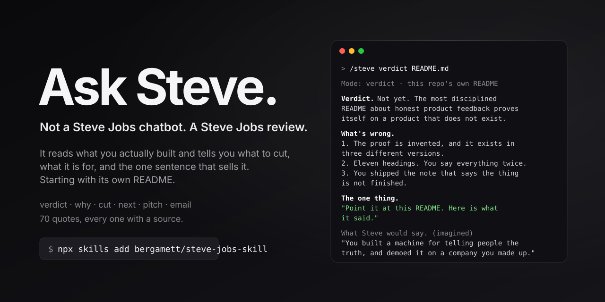

<p align="center">
  
</p>

<h1 align="center">Ask Steve</h1>

<p align="center"><strong>不是乔布斯聊天机器人。是一次乔布斯式的评审。</strong></p>

<p align="center"><a href="README.md">English</a> · <a href="README.zh-CN.md">中文</a> · <a href="README.it.md">Italiano</a></p>

<p align="center"><a href="https://bergamett.github.io/steve-jobs-skill/">bergamett.github.io/steve-jobs-skill</a></p>

其他所有"乔布斯"提示词回答的都是同一个问题："乔布斯是谁？"

没人需要这个。你需要的是另一件事：有人看着你今天下午真正做出来的东西，然后说出那句你一直在回避的话。

这个技能读你的文件、运行你的命令、数一数从 `git clone` 到第一次跑通要几步，然后给出结论：它的判断、底层的洞察、该砍掉什么、下一步是什么、以及那句能卖出去的话。

下面是它对本仓库自己的 README 的评审，在修改之前：

```
> /steve verdict README.md

Mode: verdict · this repo's own README

Verdict. Not yet. 一份关于"诚实产品反馈"的 README，却完全用一个
不存在的产品来证明自己。把它对自己的评审放在那个位置，它就成了。

What's wrong.
1. 证据是编造的，而且存在三个不同版本。TaskFlow Pro 是虚构的，README
   从没说明。README、示例文件和网站是同一次运行的三种文本，都标着
   "真实输出"。打开两个的人就不会再相信第三个。
2. 十一个标题，一千六百个词，每件事说两遍。
3. SETUP.md 放在仓库根目录。它的最后一步写着"用这个技能评审自己的
   README 并修掉它指出的问题"。你把"东西还没做完"的便条一起发布了。

What Steve would say. (imagined) "你造了一台对人说真话的机器，
然后拿一家你编出来的公司来演示它。"
```

三条都是对的，都在下一个提交里修掉了。完整评审和它引发的改动见 [`examples/self-verdict.md`](examples/self-verdict.md)。这就是整个论证，只花了一条命令。

## 安装

**Claude Code**：

```
/plugin marketplace add bergamett/steve-jobs-skill
/plugin install steve@steve
```

**任何能读 SKILL.md 的 agent**（Claude Code、Codex、Cursor、Gemini CLI、OpenCode）：

```
npx skills add bergamett/steve-jobs-skill
```

**手动**：

```
git clone https://github.com/bergamett/steve-jobs-skill
cp -r steve-jobs-skill/skills/steve ~/.claude/skills/steve
```

**普通聊天窗口**里没有文件夹可读：粘贴 [`dist/steve-full.md`](dist/steve-full.md)，它是同一个技能压平成的单个文件。

然后输入 `/steve` 加上让你烦恼的东西。不指定模式，它会自己选一个并告诉你。

| 模式 | 回答的问题 | 试试 |
|---|---|---|
| **verdict** | 乔布斯会怎么评价这个？ | `/steve verdict README.md` |
| **why** | 底层的洞察是什么？ | `/steve why are we building this` |
| **cut** | 十件事，划掉哪七件？ | `/steve cut ROADMAP.md` |
| **next** | 唯一的赌注是什么，代价是什么？ | `/steve next` |
| **pitch** | 怎么用一句话说清楚？ | `/steve pitch` |
| **email** | 怎么回复，既不撒谎也不失去对方？ | `/steve email` |

我们原本有十一个模式，划掉了五个。

## 它的不同之处

**它拿起真东西看。** 读你的文件，跑你的 CLI，数从 `git clone` 到第一次有价值的步数。它从不评审一段"产品描述"。它评审过的输入都[提交在仓库里](examples/inputs/)，你可以跑同样的命令。

**它以改写收尾。** 止于批评的批评只是吐槽。每次回复都交回新的标题、留下的三个功能、现在会告诉你该怎么做的错误信息。

**每一句引言都有出处。** [`quotes.md`](skills/steve/references/quotes.md) 为全部七十句标注场合、年份、链接和可信度，另有一张[他从未说过的名言](skills/steve/references/quotes.md#14-what-people-say-he-said-and-what-he-actually-said)表。一个[持续集成任务](scripts/check_sources.py)会在任何引言缺少出处时让构建失败。当技能写出他*会*对你的东西说什么时，它会标注"imagined"（想象）。

**它知道他哪里错了。** Cube、MobileMe、圆饼鼠标、"七英寸平板一出生就是死的"。[`failures.md`](skills/steve/references/failures.md) 还列出何时该停止听他的：无障碍、安全关键与受监管领域，以及任何你有真实使用数据与直觉相悖的时候。

**它很短，只针对作品。** 一屏。结论先行。不评价做东西的人。他可能刻薄；这个不会。

它适用的下午：你有三十个功能却没有一句话；所有人都提了需求而你全答应了；你的落地页只有你自己看得懂；你知道接下来做什么却不知道该停什么；有人要一个功能而你找不到拒绝的措辞；你盯着同一个屏幕八个月，已经看不见它了。

它不做的事：琐事、传记、"他哪一年做了什么"。其他技能做这些。它也不会假装知道 2011 年 10 月之后他会怎么想。

## 示例

真实输出。两个虚构的输入与之一起提交，并标注为虚构。

| | |
|---|---|
| [**本仓库自己的 README**](examples/self-verdict.md) | 上面的评审全文，以及它导致的改动 |
| [**一份臃肿的 README**](examples/readme-verdict.md) | 十五个功能，九步安装，没有一句话说它是什么 |
| [**十二项的路线图**](examples/roadmap-cut.md) | 两个人，900 个付费用户，每一项都有人在要 |
| [**没人听得懂的标语**](examples/pitch-devtool.md) | 做了八个月，在聚会上说不清楚 |
| [**"这是功能，不是产品"**](examples/why-insight.md) | 一个总被这样打发的想法底下的洞察 |
| [**一个愿意付真钱的客户**](examples/email-feature-request.md) | 要的是开发者不想做的移植 |
| [**停滞期的产品**](examples/next-move.md) | 4,000 免费用户，零收入，三个计划中的功能 |
| [**同一个问题，不用技能**](examples/_baseline-no-skill.md) | 和上一个对照着读 |

## 工作原理

```
skills/steve/
├── SKILL.md                    122 行：六个模式、推理循环、规则、回复的形状
└── references/
    ├── playbooks/              每个模式一份：步骤、输出模板、陷阱
    ├── quotes.md               70 句引言：场合、年份、链接、可信度
    ├── principles.md           十四条有据可查的思维动作及其证据
    ├── episodes.md             真实决策，作为可复用的模板
    ├── voice.md                他怎么说话，以及绝不能用的词
    └── failures.md             他哪里错了，以及何时不该听他的
```

`SKILL.md` 只装技能对你的作品执行的八步循环，保持很小，加载几乎不花成本。背后的十四条原则、引言和决策案例只在对应模式需要时才读取。这就是全部架构。

欢迎贡献，只有[一条规则](CONTRIBUTING.md)：不允许没有出处的引言。

## 致谢与声明

材料全部来自公开记录：斯坦福毕业演讲、1995 年"遗失的访谈"、WWDC 1997 闭幕问答、1997 年 Think Different 内部讲话、Playboy 与 Wired 访谈、历次发布会、《Thoughts on Flash》、Fortune 与 All Things Digital 访谈、乔布斯档案馆的《Make Something Wonderful》、Andy Hertzfeld 的 folklore.org、Jony Ive 的追思致辞，以及 Walter Isaacson 关于领导力课程的记述。每个来源都链接在 [`quotes.md`](skills/steve/references/quotes.md) 与 [`episodes.md`](skills/steve/references/episodes.md) 中。

本项目与 Apple Inc.、Steve Jobs Archive 或乔布斯遗产没有任何关联、授权或背书。它是一面审视你自己作品的镜片，由他公开说过的话构成。它不是他，不通灵，也不声称知道他会怎么想。凡以他的口吻写的句子，都会明确标注。

MIT 许可证。见 [LICENSE](LICENSE)。
